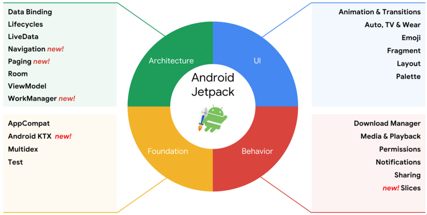

# 데이터 바인딩



데이터바인딩이란 Android Architecture Components의 한 부분으로서 UI요소와 데이터를 프로그램적 방식이 아닌 **선언적 형식**으로 결합할 수 있게 도와주는 라이브러리입니다.

MVP나 MVVP 패턴과 함께 사용했을때 더욱 효율적으로 사용할 수 있습니다.

```kotlin
// 프로그램적 방식
findViewById<TextView>(R.id.sample_text).apply{
	text = viewModel.userName
}
```

```xml
<!-- 선언적 방식 -->
<TextView
	android:text="@{viewmodel.userName}" />
```

### 장점

- 레이아웃 파일에서 구성 요소를 결합하기 때문에 액티비티의 UI 프레임호출을 삭제할 수 있어 파일이 더욱 단순화됩니다.
- xml 리소스만 보고도 View에 어떤 데이터가 들어가는지 대략적으로 파악이 가능해집니다.
- 리사이클러뷰에 item을 설정하는 부분도 자동으로 진행됩니다.
- 앱 성능이 향상됩니다.
- 메모리 누수 및 null 포인터 예외를 방지할 수 있습니다.

### 사용

1. Build.gradle(app)

    ```json
    buildFeatures {
            dataBinding true
        }
    ```

2. activity_main.xml

    ```xml
    <layout xmlns:android="http://schemas.android.com/apk/res/android"
                xmlns:app="http://schemas.android.com/apk/res-auto">
            <data>
                <variable
                    name="viewmodel"
                    type="com.myapp.data.ViewModel" />
            </data>
            <ConstraintLayout... /> <!-- UI layout's root element -->
    </layout>
    ```

    레이아웃으로 감싸고, 데이터 부분을 추가한뒤 아래에 기존의 레이아웃을 넣습니다.

3. MainActivity.kt

    ```kotlin
    class MainActivity : AppCompatActivity() {
    	private lateinit var binding: ActivityMainBinding

    	override fun onCreate(savedInstanceState: Bundle?) {
    		super.onCreate(savedInstanceState)

    		binding = DataBindingUtil.setContentView(this, R.layout.activity_main)
    	}
    }
    ```

    RecyclerView, ListView, Fragment 등에서 적용할 때는 LayoutInflater 객체를 사용

    ```kotlin
    // Fragment
    binding = FragmentBinding.inflate(inflater, container, false)
    // XML 파일 지정하지 않고 사용하기
    binding = DataBindingUtil.inflate(inflater, R.layout.fragment_test, container, false);
    // XML 파일 지정하고 사용하기
    ```

4. 이후 `@{} 혹은 @={}`구문을 사용하여 속성에 표현식을 작성한다.
    - 표현식 내에서 this, super, new, 명시적 제네릭 호출을 제외한 여러 연산자와 키워드를 사용할 수 있습니다.
    - null 병합 연산자(`??`)는 왼쪽 피연산자가 null이 아니면 왼쪽 피연산자를 선택하고, null이면 오른쪽 피연산자를 선택합니다. (kotlin의 ?:와 같은 기능)
    - ID로 레이아웃의 다른 뷰를 참조할 수 있습니다.
        - 단 결합 클래스는 ID를 카멜 표기법으로 변환합니다.

        ```xml
        <EditText
                android:id="@+id/example_text"
                android:layout_height="wrap_content"
                android:layout_width="match_parent"/>
        <TextView
                android:id="@+id/example_output"
                android:layout_width="wrap_content"
                android:layout_height="wrap_content"
                android:text="@{exampleText.text}"/>
        ```

    - 배열, 목록, 맵 같은 일반 컬렉션에는 편의상 [] 연산자를 사용하여 액세스 할 수 있습니다.

        ```xml
        <data>
                <import type="android.util.SparseArray"/>
                <import type="java.util.Map"/>
                <import type="java.util.List"/>
                <variable name="list" type="List&lt;String>"/>
                <variable name="sparse" type="SparseArray&lt;String>"/>
                <variable name="map" type="Map&lt;String, String>"/>
                <variable name="index" type="int"/>
                <variable name="key" type="String"/>
            </data>
            …
            android:text="@{list[index]}"
            …
            android:text="@{sparse[index]}"
            …
            android:text="@{map[key]}"
        ```

    - 표현식은 앱 리소스를 참조할 수도 있습니다.

        ```xml
        android:padding="@{large? @dimen/largePadding : @dimen/smallPadding}"
        ```

    - 메소드 참조도 가능합니다.

### 리사이클러뷰에서의 사용

기존

```kotlin
class TodoRecyclerAdapterImsi(private val todoItems : List<TodoItem>) : RecyclerView.Adapter<RecyclerView.ViewHolder>() {
    override fun onCreateViewHolder(parent: ViewGroup, viewType: Int): RecyclerView.ViewHolder {
        val inflater = LayoutInflater.from(parent.context).inflate(R.layout.item_todo, parent, false)
        return ItemViewHolder(inflater)
    }

    override fun onBindViewHolder(holder: RecyclerView.ViewHolder, position: Int) {
        val item = todoItems[position]
        if (holder is ItemViewHolder) {
            holder.bind(item)
        }
    }

    override fun getItemCount() = todoItems.size

    class ItemViewHolder(itemView : View) : RecyclerView.ViewHolder(itemView) {
        fun bind(item: TodoItem) {
            val tvTodo = itemView.findViewById<TextView>(R.id.tvTodo)
            tvTodo.text = item.toString()
						// 하나하나 설정
        }
    }
}
```

데이터바인딩 적용

```kotlin
class TodoRecyclerAdapter(private val todoItems : List<TodoItem>) : RecyclerView.Adapter<RecyclerView.ViewHolder>() {
    override fun onCreateViewHolder(parent: ViewGroup, viewType: Int): RecyclerView.ViewHolder {
        val binding = ItemTodoBinding.inflate(LayoutInflater.from(parent.context), parent, false)
        return ItemViewHolder(binding)
    }

    override fun onBindViewHolder(holder: RecyclerView.ViewHolder, position: Int) {
        val item = todoItems[position]
        if (holder is ItemViewHolder) {
            holder.bind(item)
        }
    }

    override fun getItemCount() = todoItems.size

    class ItemViewHolder(private val binding : ItemTodoBinding) : RecyclerView.ViewHolder(binding.root) {
        fun bind(item: TodoItem) {
            with(binding) {
                todoItem = item
            }
        }
    }
}
```

```xml
<?xml version="1.0" encoding="utf-8"?>
<layout xmlns:android="http://schemas.android.com/apk/res/android"
    xmlns:app="http://schemas.android.com/apk/res-auto">
    <data>
        <variable
            name="todoItem"
            type="com.jm.databinding_practice.model.TodoItem" />
    </data>
    <androidx.constraintlayout.widget.ConstraintLayout
        android:layout_width="wrap_content"
        android:layout_height="wrap_content">
        <TextView
            android:id="@+id/tvTodo"
            android:layout_width="wrap_content"
            android:layout_height="wrap_content"
            android:text="@{todoItem.toString()}"
            app:layout_constraintTop_toTopOf="parent"
            app:layout_constraintStart_toStartOf="parent"
            />
    </androidx.constraintlayout.widget.ConstraintLayout>
</layout>
```

주요 차이점

- View 전달 → binding 객체 전달
- findViewById를 통해 view를 받은 뒤 각각 데이터 설정
- 어댑터는 데이터 전달만 해주면 되고 View를 직접 다룰일이 없어 코드가 많이 줄어들게 된다.